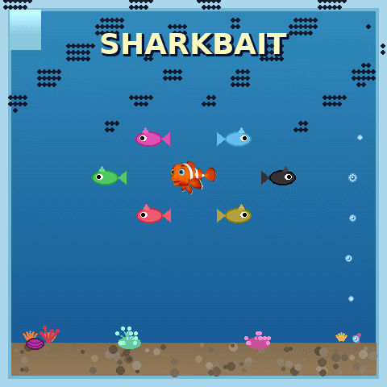
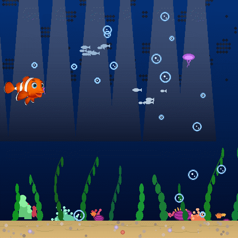
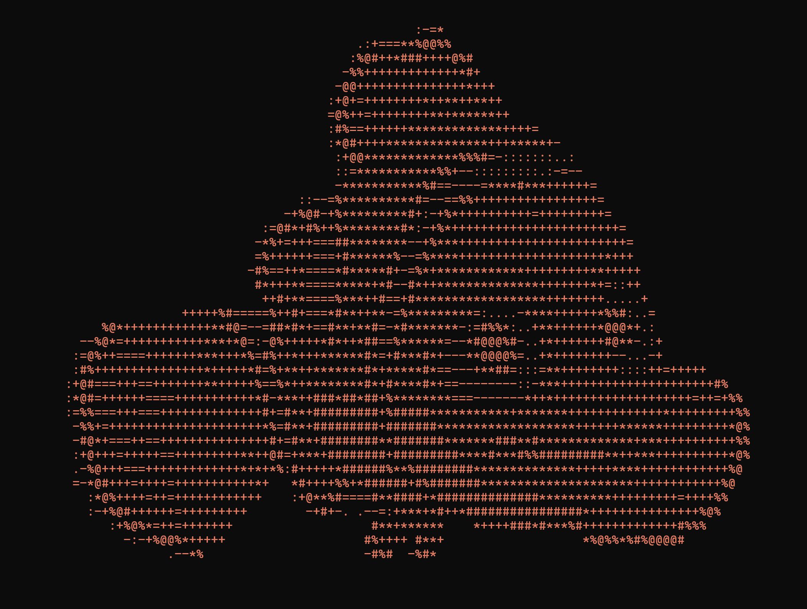
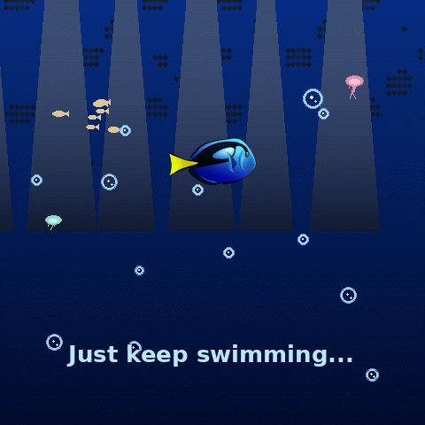
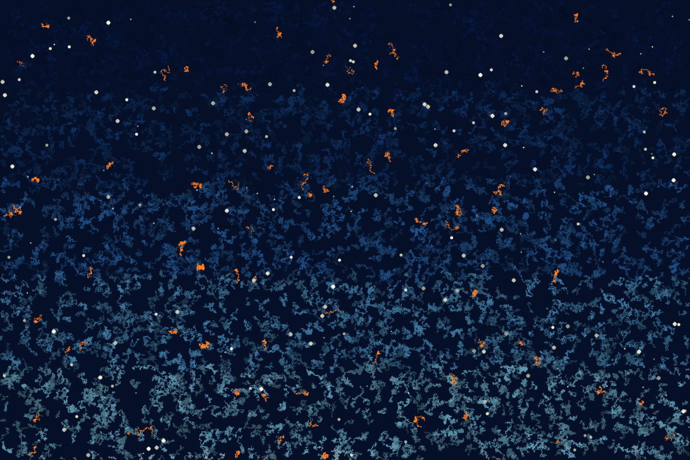
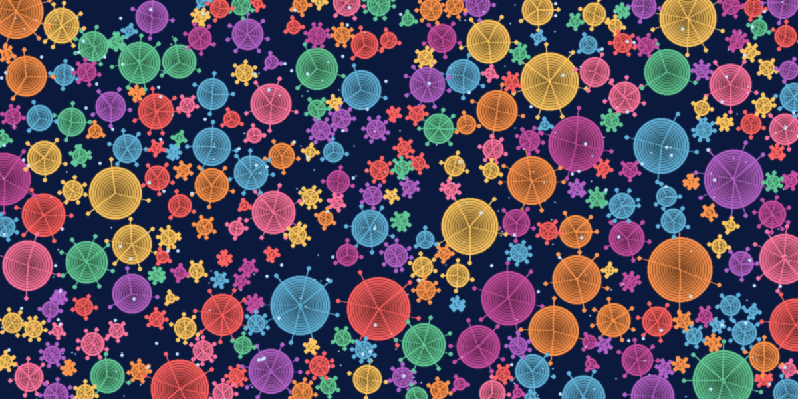
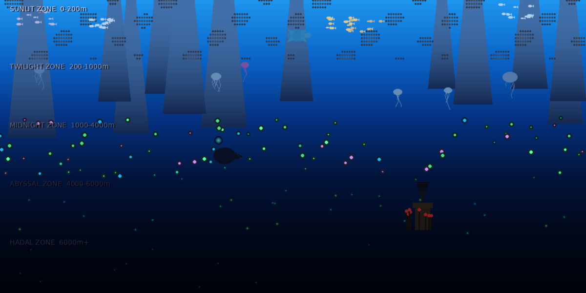
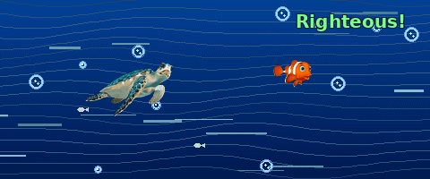

# Sharkbait

<p align="center">
  
</p>

<p align="center">
  <strong>"Sharkbait, ooh ha ha!"</strong><br>
  <em>An AI coding assistant that won't leave you swimming in circles</em>
</p>

<p align="center">
  <a href="#features">Features</a> •
  <a href="#installation">Installation</a> •
  <a href="#skills--plugins">Skills & Plugins</a> •
  <a href="#usage">Usage</a> •
  <a href="#architecture">Architecture</a> •
  <a href="#license">License</a>
</p>

<p align="center">
  
  
  
  
  
  
  
</p>

<p align="center">
  
</p>

> **Experimental**: This project is under active development. APIs may change, features may break, and Dory might forget what she was doing. Use at your own risk!

> *"Just keep coding, just keep coding..."* — Dory, probably

Sharkbait is a CLI-based AI coding assistant built with Bun and TypeScript. It uses the **OpenAI Responses API** (not Chat Completions) for enhanced tool calling and streaming. Like Nemo escaping the dentist's fish tank, it helps you break free from tedious coding tasks.

The development environment is powered by **Anthropic skills** and **Claude Code plugins** that provide specialized workflows across design, engineering, research, and operations.

<p align="center">
  
</p>

## The ASCII Shark

```
                              +.+++.
                            ## ....-### -
                           +  ###++++-#++-
                           - ##+-++--+-+--.
                             #++++-+-------..
                           - -#+-----++-.....
                           ##-.----+-.  ###########
                           #..-++--. +#####+.   .. .
                       ####..--+--..##. ...-+####++-.
                     #  . .-.--+-. ## .+++++++++++-++..
                    # ##+### -+--.## .--+++++++++++++-+
                   + .#+-###.--+.-# -+--------+++++-...
                     -#.-###.--- #+.+---... ...-+++-.###
                  ###.--+##-.++.## ---...####...-+++- .###
    #           .. ##- --## -#.-#.-+...##   ###.-++++   ##+
   #- ###+--+#---#- # +++-..#-.+# +-.-##.    ##-.-+++#####.
  ## ##---+##+--++#+.+-+-+--+-.+#.+-.####--.###+.-+++.###+.
  # .#+++----++-+-++.#..+-.---.#+---..########..-++++-....-+##-.
  #. #++##++--+----+--#.#-----.#+-----........-+++++++++++-----+#.
  #- #++-+++++++--+++.# -#..--.+#.--------....--+++++--.--.#++++#+
  +# ##---+++++++---+.+#.-#+---.#+..-------++--.....--++-.++--++#.
   # .##+++--++-++-+-....++- ....+#...----++--++####++..-##++++##
    #  ###+++-++-++..  .    +##..+.+#-......------....+#+++++##-
     #   #####+++.           ## ++--+.  ..      .-###########-
       #.    .+.                ..- +.               .###-
           #-.                +   #
```

<p align="center">
  
</p>

## Features

<p align="center">
  
</p>

- **Fast** — Built on Bun. Swims through code faster than Marlin crossing the EAC
- **Responses API** — Uses OpenAI's Responses API for better streaming and tool calling
- **Tool-equipped** — File ops, shell commands, Git, GitHub. Everything but the Ring of Fire
- **Persistent Memory** — Beads give your AI long-term memory that survives sessions (unlike Dory)
- **Git-backed Context** — Your AI's memory lives in your repo. Clone it, branch it, merge it
- **Beautiful UI** — Ink-based terminal interface. P. Sherman would approve
- **Safe** — Confirms dangerous operations before executing. No surprise `rm -rf` moments

### The Memory Problem

Most AI coding assistants have the memory of... well, Dory. They forget context between sessions, lose track of what you were working on, and make you repeat yourself constantly.

**Sharkbait is different.** Built-in **Beads** provide persistent, git-backed memory that survives across sessions:

- **Task Memory**: Create a bead for a feature, and Sharkbait remembers the context, decisions, and progress — even after you close the terminal
- **Git-Native**: Beads are stored alongside your code in git, so your AI's memory travels with your repo
- **No External Services**: Your context stays local. No cloud sync, no API calls for memory — just git

<p align="center">
  <picture>
    <source media="(prefers-color-scheme: dark)" srcset="public/images/terminal-welcome.png">
    <source media="(prefers-color-scheme: light)" srcset="public/images/terminal-welcome.png">
    
  </picture>
</p>

<p align="center">
  
</p>

## Skills & Plugins

<p align="center">
  
</p>

Sharkbait's development environment ships with the full [Anthropic Skills](https://github.com/anthropics/skills) catalog and a curated set of Claude Code plugins. These are used during development with Claude Code — they are not runtime features of the Sharkbait application itself.

### Installed Anthropic Skills

| Category | Skills | What They Do |
|----------|--------|--------------|
| **Design** | `canvas-design`, `frontend-design`, `brand-guidelines`, `theme-factory` | Visual art, production-grade UI, brand colors, themed styling |
| **Art & Media** | `algorithmic-art`, `slack-gif-creator` | Generative art with p5.js, animated GIF creation |
| **Documents** | `docx`, `pdf`, `pptx`, `xlsx`, `doc-coauthoring` | Create/edit Office docs, PDFs, spreadsheets, co-author documents |
| **Engineering** | `web-artifacts-builder`, `mcp-builder`, `webapp-testing` | Multi-component web apps, MCP servers, browser testing |
| **Meta** | `skill-creator`, `internal-comms` | Create new skills, write internal communications |

### Active Plugins

<details>
<summary><strong>Core Engineering (14 plugins)</strong></summary>

| Plugin | Purpose |
|--------|---------|
| `compound-engineering` | Multi-agent workflows: plan, brainstorm, review, work |
| `feature-dev` | Guided feature development with codebase understanding |
| `code-review` | PR review with specialized analysis agents |
| `pr-review-toolkit` | Silent failure hunting, type design, test coverage |
| `code-simplifier` | Post-implementation code clarity pass |
| `coderabbit` | AI code review on changes |
| `hookify` | Create hooks to prevent unwanted behaviors |
| `plugin-dev` | Build and validate Claude Code plugins |
| `agent-sdk-dev` | Verify Agent SDK applications |
| `claude-code-setup` | Automation recommendations |
| `claude-md-management` | CLAUDE.md auditing and improvement |
| `playground` | Interactive HTML playground creation |
| `commit-commands` | Commit, push, PR workflows |
| `github` | GitHub integration |

</details>

<details>
<summary><strong>Language Servers (11 LSPs)</strong></summary>

| Plugin | Language |
|--------|----------|
| `typescript-lsp` | TypeScript/JavaScript |
| `pyright-lsp` | Python |
| `gopls-lsp` | Go |
| `clangd-lsp` | C/C++ |
| `csharp-lsp` | C# |
| `jdtls-lsp` | Java |
| `kotlin-lsp` | Kotlin |
| `lua-lsp` | Lua |
| `php-lsp` | PHP |
| `rust-analyzer-lsp` | Rust |
| `swift-lsp` | Swift |

</details>

<details>
<summary><strong>Knowledge Work (10 plugins)</strong></summary>

| Plugin | Domain |
|--------|--------|
| `data` | SQL, dashboards, visualizations, statistical analysis |
| `marketing` | Campaigns, brand voice, SEO, content, competitive analysis |
| `finance` | Journal entries, reconciliation, SOX, variance analysis |
| `legal` | Contract review, NDA triage, compliance checks |
| `product-management` | Specs, roadmaps, sprint planning, user research |
| `sales` | Pipeline, forecasting, outreach, competitive intel |
| `customer-support` | Triage, research, escalation, KB articles |
| `enterprise-search` | Cross-source search, knowledge synthesis |
| `productivity` | Task management, memory systems |
| `bio-research` | PubMed, ChEMBL, clinical trials, bioRxiv, scRNA-seq |

</details>

<details>
<summary><strong>Utilities & AI (5 plugins)</strong></summary>

| Plugin | Purpose |
|--------|---------|
| `ralph-loop` | Autonomous agent loop |
| `huggingface-skills` | HF Hub: models, datasets, training, evaluation |
| `context7` | Up-to-date library documentation |
| `playwright` | Browser automation and testing |
| `frontend-design` | Production-grade frontend components |

</details>

### Compound Engineering Workflows

The `compound-engineering` plugin provides multi-agent orchestration:

| Workflow | Command | Description |
|----------|---------|-------------|
| **Plan** | `/plan` | Transform feature descriptions into structured plans |
| **Brainstorm** | `/brainstorm` | Explore requirements through collaborative ideation |
| **Work** | `/work` | Execute plans efficiently with quality gates |
| **Review** | `/review` | Exhaustive multi-agent code review |
| **Compound** | `/compound` | Document solved problems for future reference |

<p align="center">
  
</p>

## Installation

```bash
# From source
git clone https://github.com/shyamsridhar123/sharkbait.git
cd sharkbait
bun install
bun run build:binary
```

## Prerequisites

- **Bun** >= 1.0.0
- **Git** >= 2.30
- **gh** (GitHub CLI) >= 2.40 (optional, for GitHub features)
- Azure OpenAI API access

## Configuration

1. Set up your Azure OpenAI credentials:

```bash
export AZURE_OPENAI_ENDPOINT="https://your-resource.openai.azure.com"
export AZURE_OPENAI_API_KEY="your-api-key"
export AZURE_OPENAI_DEPLOYMENT="gpt-codex-5.2"
```

2. Or create a `.env` file:

```bash
cp .env.example .env
# Edit .env with your credentials
```

<p align="center">
  
</p>

## Usage

### Interactive Chat

```bash
sharkbait chat
```

### One-off Question

```bash
sharkbait ask "How do I refactor this function?"
```

### Autonomous Task Execution

```bash
sharkbait run "Add input validation to the login endpoint"
```

### Initialize in Project

```bash
cd your-project
sharkbait init
```

## Slash Commands

During an interactive chat session, use slash commands for quick actions:

### Navigation
| Command | Description |
|---------|-------------|
| `/cd <path>` | Change working directory (creates if needed) |
| `/pwd` | Show current working directory |

### Session
| Command | Description |
|---------|-------------|
| `/clear` | Clear message history |
| `/exit` | Exit Sharkbait (aliases: `/quit`, `/q`) |

### Configuration
| Command | Description |
|---------|-------------|
| `/beads [on\|off]` | Toggle or check Beads task tracking |
| `/model [name]` | Show or switch the LLM model |
| `/tasks` | Show Beads task status |
| `/context [add\|remove\|list]` | Manage context files |

### Actions
| Command | Description |
|---------|-------------|
| `/setup` | Launch interactive setup wizard |
| `/init` | Initialize Sharkbait in current directory |
| `/ask <question>` | Ask a one-off question |
| `/run <task>` | Execute a task autonomously |
| `/review <file>` | Run parallel code review (bugs, security, style, performance) |

### Information
| Command | Description |
|---------|-------------|
| `/version` | Show Sharkbait version |
| `/help [command]` | Show available commands or help for a specific command |

**Example:** Run a parallel code review:
```
> /review src/auth.ts
Starting parallel review: bugs, security, style, performance on src/auth.ts
[Progress bars for each reviewer mode]
Parallel Review Complete (12.3s)
```

[Full Slash Commands Reference](docs/COMMANDS.md)

<p align="center">
  
</p>

## Available Tools

Sharkbait has access to 36 tools across different categories:

| Category | Tools |
|----------|-------|
| **File Operations** | `read_file`, `write_file`, `edit_file`, `list_directory`, `search_files`, `grep_search`, `create_directory` |
| **Shell** | `run_command`, `open_file` |
| **Beads** | `beads_status`, `beads_init`, `beads_ready`, `beads_create`, `beads_show`, `beads_done`, `beads_add_dependency`, `beads_list` |
| **Git** | `git_status`, `git_diff`, `git_commit`, `git_push`, `git_branch`, `git_log` |
| **GitHub** | `github_create_pr`, `github_list_prs`, `github_merge_pr`, `github_create_issue`, `github_workflow_status`, `github_pr_view`, `github_issue_list` |
| **Codebase** | `analyze_codebase`, `find_dependencies`, `map_architecture` |
| **Web/Fetch** | `fetch_webpage`, `fetch_json`, `web_search` |

## Specialized Agents

Sharkbait uses a multi-agent architecture with specialized agents for different tasks:

| Agent | Purpose |
|-------|---------|
| **Orchestrator** | Routes requests to the appropriate specialized agent based on intent |
| **Coder** | Writes, modifies, and refactors code with tool access |
| **Reviewer** | Reviews code for bugs, security, style, and performance issues |
| **Explorer** | Maps codebase architecture and finds relevant files |
| **Planner** | Breaks down complex tasks into actionable steps |
| **Debugger** | Traces issues and diagnoses bugs |
| **Parallel Executor** | Runs multiple agent tasks concurrently (e.g., parallel code reviews) |

<p align="center">
  
</p>

## Architecture

<p align="center">
  
</p>

Sharkbait implements a sophisticated agentic loop with:

- **Dual-ledger progress tracking**: Inspired by Microsoft's Magentic-One research
- **Intelligent context compaction**: Preserves critical context while managing token limits
- **Action reversibility classification**: Classifies commands as easy/effort/irreversible
- **Stall detection & recovery**: Automatic re-planning when stuck

### Tech Stack

| Component | Technology | Reason |
|-----------|------------|--------|
| Runtime | Bun | Fast startup, native TS |
| Language | TypeScript | Type safety |
| LLM | Azure OpenAI GPT Codex 5.2 | Enterprise |
| Memory | Beads (built-in) | Git-backed persistence |
| GitHub | git + gh CLI | No Octokit needed |
| CLI UI | ink | React for terminals |
| CLI Framework | commander | Argument parsing |

## Development

```bash
# Install dependencies
bun install

# Run in development mode
bun run dev

# Run tests
bun test

# Type check
bun run typecheck

# Build for distribution
bun run build:binary

# Build for all platforms
bun run build:all
```

## Configuration Options

| Environment Variable | Description | Default |
|---------------------|-------------|---------|
| `AZURE_OPENAI_ENDPOINT` | Azure OpenAI endpoint URL | (required) |
| `AZURE_OPENAI_API_KEY` | Azure OpenAI API key (falls back to Azure Identity if unset) | (optional) |
| `AZURE_OPENAI_DEPLOYMENT` | Model deployment name | `gpt-codex-5.2` |
| `AZURE_OPENAI_API_VERSION` | API version (Responses API requires 2025-03-01-preview+) | `2025-03-01-preview` |
| `SHARKBAIT_LOG_LEVEL` | Log level (debug/info/warn/error) | `info` |
| `SHARKBAIT_LOG_FILE` | Enable file logging to ~/.sharkbait/logs | `false` |
| `SHARKBAIT_LOG_JSON` | Use JSON format for console output | `false` |
| `SHARKBAIT_LOG_DIR` | Custom log file directory | `~/.sharkbait/logs` |
| `SHARKBAIT_TELEMETRY` | Enable opt-in anonymous telemetry | `false` |
| `SHARKBAIT_MAX_CONTEXT_TOKENS` | Max context window tokens | `100000` |
| `SHARKBAIT_CONFIRM_DESTRUCTIVE` | Require confirmation for destructive commands | `true` |
| `SHARKBAIT_WORKING_DIR` | Default working directory | (current directory) |

<p align="center">
  
</p>

## Logging & Monitoring

### Structured Logging

```bash
# Enable debug logging
export SHARKBAIT_LOG_LEVEL=debug

# Enable file logging (writes to ~/.sharkbait/logs/sharkbait.log)
export SHARKBAIT_LOG_FILE=true

# Use JSON format for machine-readable logs
export SHARKBAIT_LOG_JSON=true
```

Log output includes timestamps, levels, and contextual information:
```
[18:55:21.545] [INFO ] [coder] Agent started processing
[18:55:21.560] [INFO ] config.load (8ms)
```

### File Logging

When enabled, logs are written as newline-delimited JSON:
```json
{"timestamp":"2026-01-29T18:55:21.545Z","level":"info","message":"Agent started","context":{"agent":"coder","correlationId":"abc123"}}
```

Features:
- Automatic rotation at 10MB (keeps 5 files)
- Structured JSON for easy parsing
- Context propagation (agent, tool, correlationId)

### Performance Monitoring

Built-in metrics track:
- LLM call latencies (avg, p50, p90, p99)
- Tool execution times
- Memory usage
- Token consumption

### Distributed Tracing

Trace agent execution with OpenTelemetry-inspired spans:
```
agent: coder (1250ms)
  llm: gpt-codex-5.2 (800ms)
  tool: file_read (45ms)
  tool: file_write (120ms)
```

### Telemetry (Opt-in)

Anonymous usage analytics can be enabled to help improve Sharkbait:
```bash
export SHARKBAIT_TELEMETRY=true
```

**What's collected:** Event counts (sessions, tool usage), latency metrics
**What's NOT collected:** File paths, code content, prompts, personal info

### Configuration File

Sharkbait stores configuration in `~/.sharkbait/config.json`. Example:

```json
{
  "azure": {
    "deployment": "gpt-codex-5.2"
  },
  "features": {
    "beads": true,
    "confirmDestructive": true
  },
  "paths": {
    "defaultWorkingDir": "/path/to/your/project"
  }
}
```

<p align="center">
  
</p>

## Generative Art Gallery

Created with the `algorithmic-art` and `canvas-design` skills:

<p align="center">
  
  <br><em>Ocean Flow Field — 4,000 particles tracing noise-driven current vectors</em>
</p>

<p align="center">
  
  <br><em>Coral Reef — Circle-packed generative polyp colonies</em>
</p>

<p align="center">
  
  <br><em>Depth Gradient — Five ocean zones from sunlit to hadal with bioluminescence</em>
</p>

<p align="center">
  
</p>

## Security

Sharkbait includes multiple layers of security:

1. **Blocked commands**: Dangerous patterns like `rm -rf /` are blocked
2. **Reversibility classification**: Commands are classified by how easy they are to undo
3. **Confirmation prompts**: Destructive operations require confirmation
4. **Secret redaction**: API keys and passwords are not logged

## License

This project is licensed under the MIT License - see the [LICENSE](LICENSE) file for details.

## Contributing

Contributions welcome! Please see the backlog in `backlog/tasks/` for open items.

<p align="center">
  
  <br>
  <em>"You so totally rock, Squirt!" — Crush</em>
</p>
